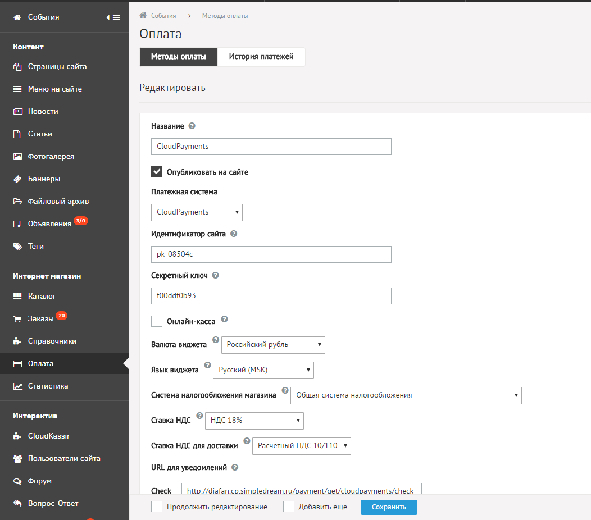

Модуль позволит с легкостью добавить на ваш сайт оплату банковскими картами через платежный сервис [CloudPayments](https://cloudpayments.ru).
Порядок регистрация сайта описан в документации CloudPayments https://cloudpayments.ru/Docs/Connect

### Возможности:  
• Одностадийная схема оплаты;  
• Двухстадийная схема оплаты;  
• Выбор дизайн виджета;  
• Поддержка онлайн-касс (ФЗ-54);  
• Отправка чеков по email;  
• Отправка чеков по SMS;  
• Отдельная настройка НДС для доставки;

### Совместимость
• Diafan.CMS v.6.0.X и выше;

### Установка модуля
Разархивируйте модуль и скопируйте каталог modules в корень сайта
  

## Техническая настройка
### Личный кабинет CloudPayments
В личном кабинете CloudPayments в настройках сайта необходимо включить следующие уведомления:

* **Запрос на проверку платежа** (Сheck):\
http://domain.ru/payment/get/cloudpayments/check
* **Уведомление о принятом платеже** (Pay):\
http://domain.ru/payment/get/cloudpayments/pay
* **Уведомление при отклоненном платеже** (Fail):\
http://domain.ru/payment/get/cloudpayments/fail
* **Уведомление о подтверждении платежа** (Сonfirm):\
http://domain.ru/payment/get/cloudpayments/confirm
* **Уведомление об отменене платежа** (Сancel):\
http://domain.ru/payment/get/cloudpayments/cancel
* **Уведомление о возврате платежа** (Refund):\
http://domain.ru/payment/get/cloudpayments/refund

Где domain.ru — доменное имя вашего сайта.
Во всех случаях требуется выбирать вариант по умолчанию: кодировка — UTF-8, HTTP-метод — POST, формат — CloudPayments
Данные URL можно скопировать из настройки модуля CloudPayments в панели администрирования DiafanCMS

### Панель администратора DiafanCMS
В разделе "Оплата" (Интернет-магазин) необходимо добавить новый способ оплаты и указать платежную систему CloudPayments
Затем указать следующий настройки:
* **Идентификатор сайта** — Public id сайта из личного кабинета CloudPayments
* **Секретный ключ** — API Secret из личного кабинета CloudPayments
* **Язык виджета** — Язык интерфейса виджета
* **Валюта виджета** — Валюта в которой будет происходить оплата

#### При использовании интеграции с онлайн-кассой
* **Онлайн-касса** — Включение/отключение формирования онлайн-чека при оплате
* **Система налогообложения** — Тип системы налогообложения. Возможные значения перечислены в документации CloudPayments https://cloudpayments.ru/Docs/Directory#taxation-system
* **Ставка НДС** — Указание ставки НДС. Все возможные значения указаны в документации https://cloudpayments.ru/Docs/Kassa#data-format
* **Ставка НДС для доставки** — Указание ставки НДС для доставки. Аналогично ставке НДС.

После указания всех данных сохранить настройки.

